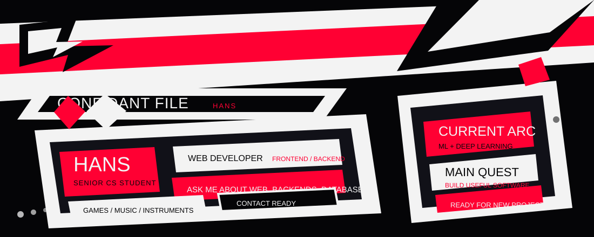

# TAKE YOUR CODE

## CONFIDANT FILE

I am a <strong>Senior Computer Science</strong> student with a solid foundation in computer programming, data structures, and algorithms. My current academic focus includes advanced web development, software engineering, database management, Machine Learning, and Deep Learning. I enjoy joining new projects, helping other developers, and building creative software with a bit of style.

## ARSENAL

### Languages

### Frontend Stack

### Backend Stack

### Machine Learning / Deep Learning

### Deployment, Databases, and Tools

## THIEVES' LEDGER

